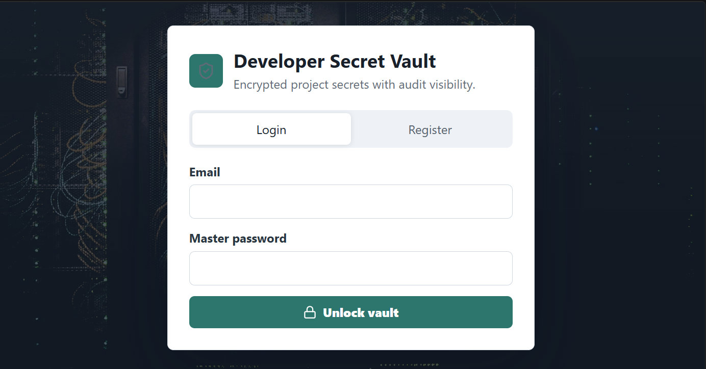
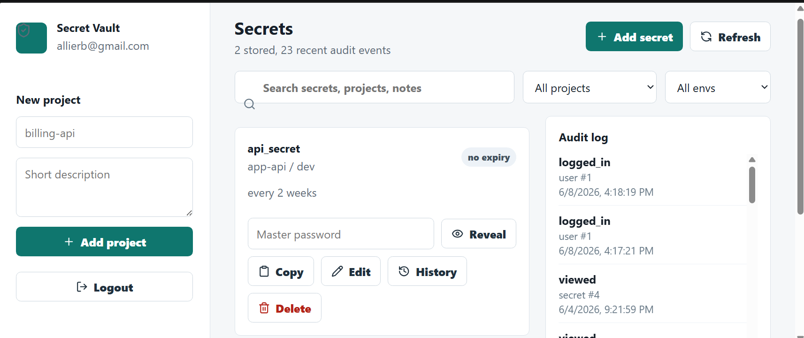
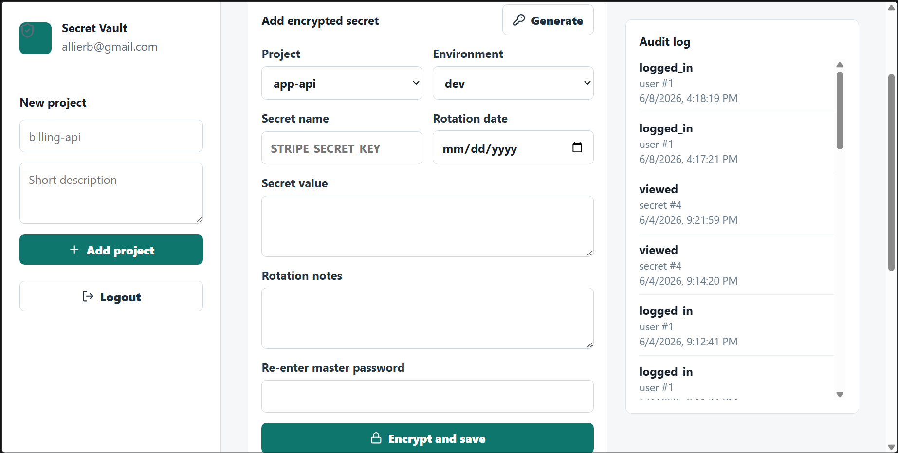
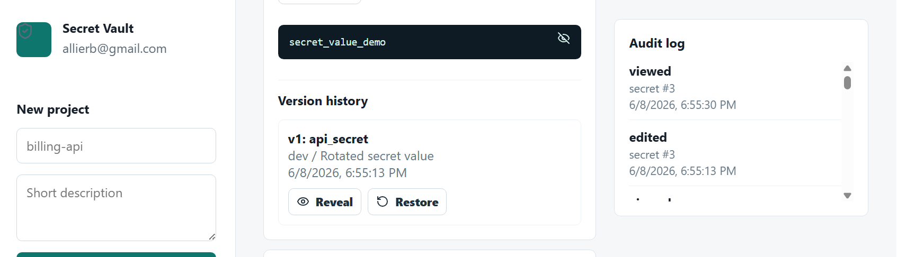
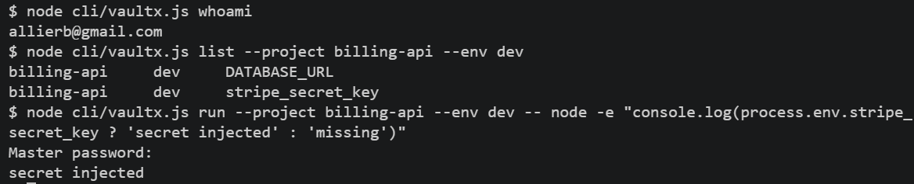

# Developer Secret Vault

A full-stack security project for storing, rotating, and using developer secrets without keeping plaintext values in the database.

The app is built as a small-team developer vault: users can organize secrets by project and environment, reveal values only after master-password re-entry, view audit events, edit secrets with encrypted version history, and use a local CLI to inject secrets into development commands.

## Features

- User registration and login
- Argon2id password hashing
- HTTP-only browser sessions
- Project folders and environment labels
- AES-256-GCM encrypted secret values
- Master-password re-entry before creating, revealing, editing, or restoring secrets
- Show/hide secret flow
- Copy-to-clipboard support
- Search and filtering by project, environment, name, or notes
- Strong secret generator
- Secret expiration dates and rotation notes
- Audit logs for sensitive actions
- Secret editing with encrypted version history
- Restore previous secret versions
- Node.js CLI for listing, retrieving, and injecting secrets

## Tech Stack

- React
- Express
- Node.js
- SQLite
- Argon2id
- AES-256-GCM
- Vite

## Security Architecture

This project is designed as a portfolio-grade security application, not production secrets infrastructure.

The core security model:

- Passwords are hashed with Argon2id before storage.
- Each user receives a random vault key.
- The vault key is encrypted with a key derived from the user's master password.
- Secret values are encrypted with AES-256-GCM before being written to SQLite.
- Previous secret versions are also stored encrypted.
- Sensitive actions require master-password re-entry.
- Reveal, copy, edit, delete, version reveal, and restore actions are audit logged.
- Browser sessions use HTTP-only cookies.
- CLI sessions use bearer tokens stored locally in `~/.vaultx/config.json`.
- The CLI never stores the master password.

See [THREAT_MODULE.md](THREAT_MODULE.md) for the full threat model, assumptions, controls, and future hardening plan.

## Run Locally

```bash
npm install
npm run dev
```

The API runs on:

```text
http://localhost:4000
```

The web app runs on the Vite URL shown in the terminal, usually:

```text
http://localhost:5173
```

If that port is busy, Vite may use another port such as `5174`.

Run tests:

```bash
npm test
```

## CLI Usage

The repo includes a local CLI named `vaultx`.

Login:

```bash
npm run vaultx -- login
```

Check the active account:

```bash
npm run vaultx -- whoami
```

List secrets:

```bash
npm run vaultx -- list
npm run vaultx -- list --project billing-api --env dev
```

Retrieve one secret:

```bash
npm run vaultx -- get STRIPE_SECRET_KEY --project billing-api --env dev
```

Run a command with matching secrets injected as environment variables:

```bash
npm run vaultx -- run --project billing-api --env dev -- npm start
```

Example:

```bash
npm run vaultx -- run --project billing-api --env dev -- node -e "console.log(process.env.STRIPE_SECRET_KEY)"
```

## Manual Test Flow

1. Register or log in.
2. Create a project.
3. Add a secret with an environment, value, rotation notes, and expiration date.
4. Re-enter the master password to save it.
5. Reveal and copy the secret.
6. Edit the secret value or metadata.
7. Open version history.
8. Reveal a previous encrypted version.
9. Restore a previous version.
10. Confirm audit events were recorded.
11. Use the CLI to list and retrieve the same secret.

## Known Limitations

- SQLite uses Node's experimental `node:sqlite` module in this local version.
- The app is single-user scoped internally; team sharing and RBAC are not implemented yet.
- MFA/TOTP is not implemented yet.
- There is no hosted production deployment.
- The CLI stores a local session token but does not yet support explicit logout or token rotation.
- This is not intended to replace production systems like HashiCorp Vault, AWS Secrets Manager, Doppler, Infisical, or 1Password Secrets Automation.

## Roadmap

- TOTP MFA
- Team workspaces and RBAC
- CLI logout and token management
- Secret import/export
- Rotation reminder dashboard
- Encrypted backup flow
- PostgreSQL migration
- Docker Compose setup

## Resume Summary

Built a full-stack developer secrets vault with Argon2id authentication, AES-256-GCM encrypted storage, audit logging, encrypted secret version history, and a Node.js CLI for injecting secrets into local development commands.

## Screenshots

### Login Screen



### Vault Dashboard



### Add Secret Flow



### Secret Version History



### CLI


